# Hermes WebUI — NothingOS Edition

A **NothingOS-inspired** web interface for [Hermes Agent](https://hermes-agent.nousresearch.com/) —
a dark monochrome **command surface**, not a recoloured chat app. One red accent
used as a signal, dot-matrix identity, an ambient status strip that expresses
agent state as light, and OS-style glance widgets. Built on the stable
[nesquena/hermes-webui](https://github.com/nesquena/hermes-webui) backend
(Python + vanilla JS — no build step, no framework, no bundler).

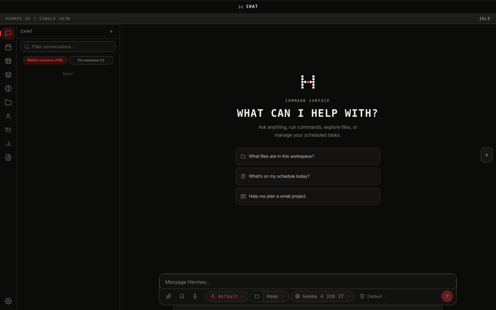

<table>
  <tr>
    <td width="50%" align="center">
      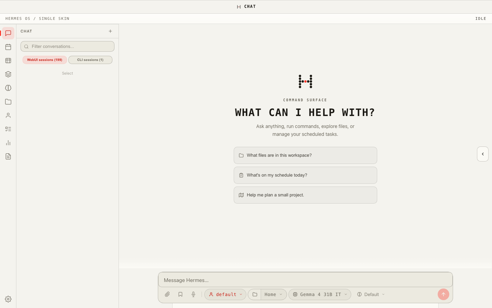<br />
      <sub>Light theme — same design language, inverted surfaces</sub>
    </td>
    <td width="50%" align="center">
      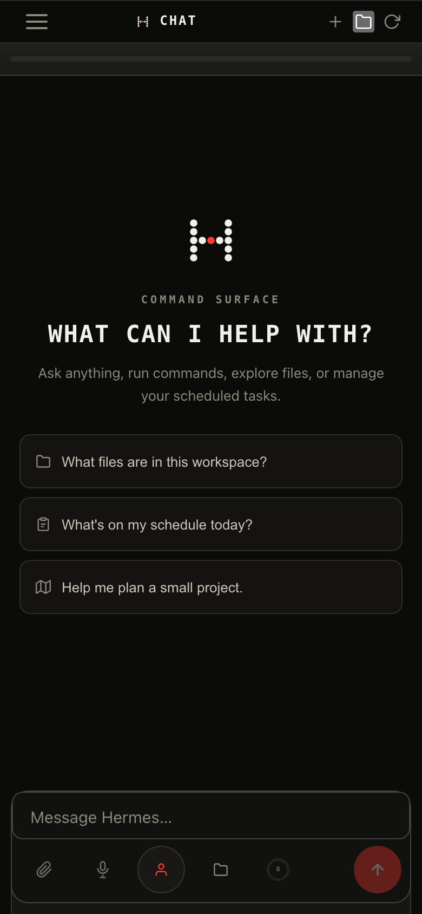<br />
      <sub>Mobile — full-width single surface (390px, no overflow)</sub>
    </td>
  </tr>
</table>

---

## What's different in this edition

- **One design language — NothingOS, rebuilt inside every surface.** Not a CSS
  overlay on the old shell: the content, typography and interaction layer of each
  route was rebuilt into an OS command surface. Three typography tiers (display /
  body sans / technical mono), depth from borders and nesting (no drop shadows),
  and a controlled dot-matrix identity.
- **Red is a signal, not paint.** At most one primary red block per page; code
  chips are neutral by default; a selected row shows a thin red index, never a
  red wash.
- **Ambient status strip.** The top strip expresses agent state as light —
  idle, thinking (dot ripple), tool-running (segmented strip), waiting-approval
  (red breathing), error, complete (white sweep) — instead of a noisy banner.
- **Glance widgets.** Current run, model, pending approvals and next cron read
  from live state in the workspace panel (feed-only — no extra API calls).
- **Light / Dark toggle.** A two-button switch in **Settings → Appearance**
  (default **Dark**, remembered). One skin only — no "System/auto", no legacy
  skins, and old `skin`/`theme` values in your browser cannot change it back.
- **Single-surface mobile.** At phone width every route is full width with no
  horizontal overflow; filters and controls collapse into disclosures/sheets.
- **Four extra features** carried over from the Tungbillee fork:
  - `GET /api/agent-configs` — inspect/edit agent model & memory config
  - `GET /api/dash/cost` — per-agent token cost
  - `GET /api/dash/roster` — map a Kanban board → agent profiles
  - `GET|POST /api/library/*` — per-team document library
- **No React SPA, no `/v2` route** — `/` serves the static shell directly.
- **Everything else** (chat, sessions, workspace browser, profiles, cron, skills,
  memory, voice) comes from the stable upstream and works as-is.

---

## Screens

Every route shares the one command-surface language — a mono ambient strip up top,
an icon rail on the left, an OS surface in the middle. Captured at 1440px, dark.

<table>
  <tr>
    <td width="50%" align="center">
      <br />
      <sub><b>Chat</b> — OS empty-state, command-line composer</sub>
    </td>
    <td width="50%" align="center">
      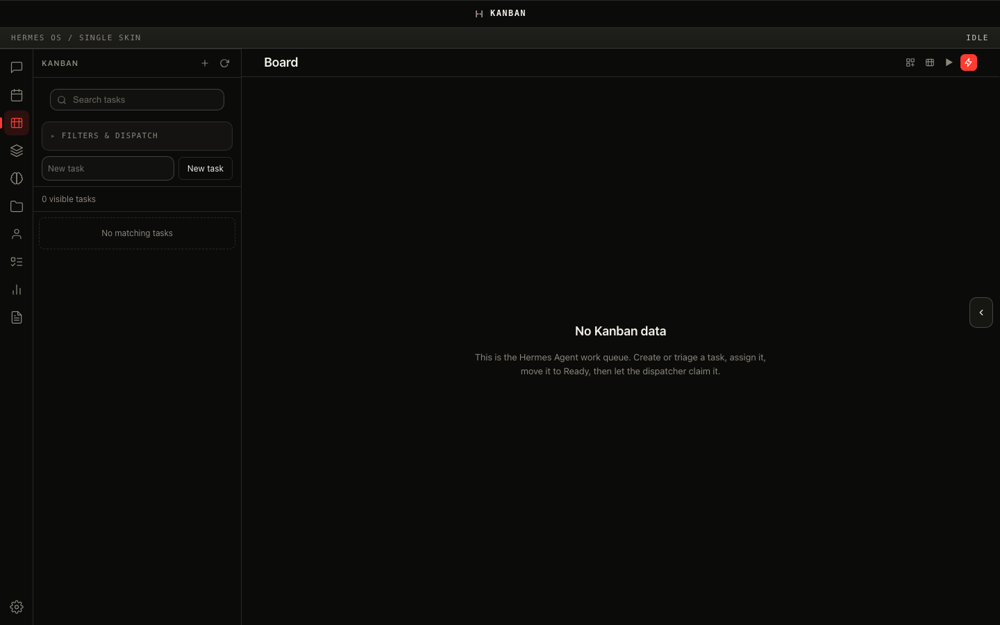<br />
      <sub><b>Kanban</b> — work queue; filters collapse into a disclosure</sub>
    </td>
  </tr>
  <tr>
    <td align="center">
      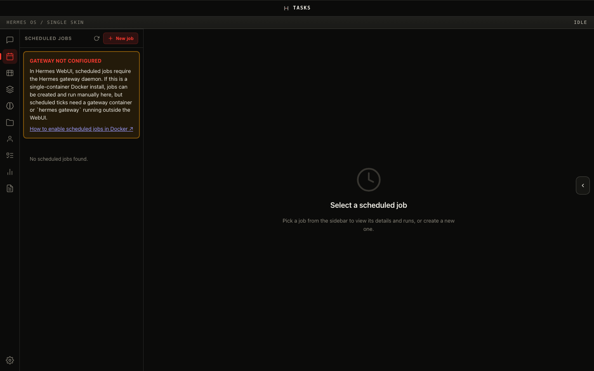<br />
      <sub><b>Cron / Tasks</b> — scheduled jobs with LED status</sub>
    </td>
    <td align="center">
      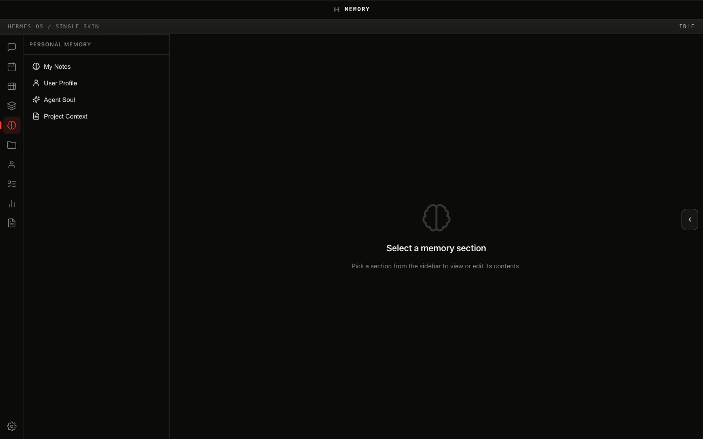<br />
      <sub><b>Memory</b> — sectioned reader, neutral code chips</sub>
    </td>
  </tr>
  <tr>
    <td align="center">
      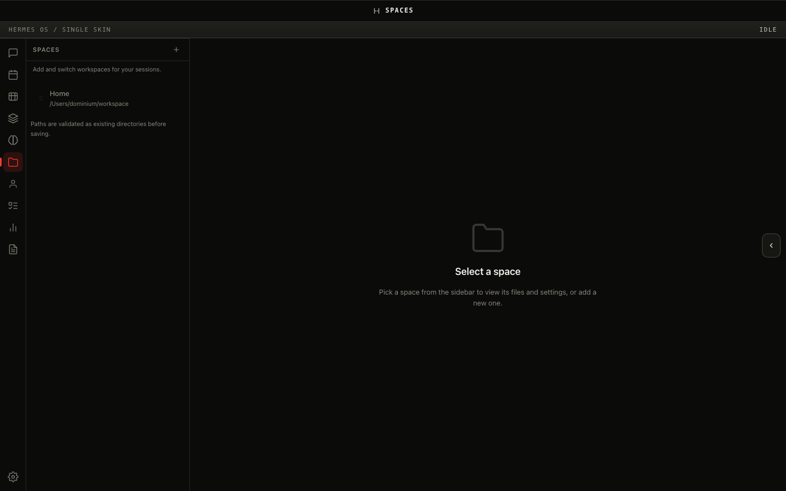<br />
      <sub><b>Workspaces</b> — tactile file rows, Files/Artifacts segments</sub>
    </td>
    <td align="center">
      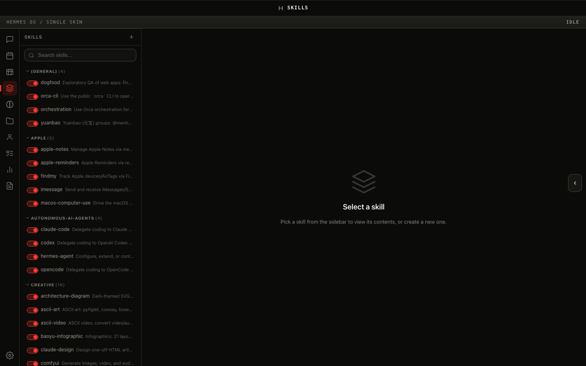<br />
      <sub><b>Skills</b> — grouped list with enable toggles</sub>
    </td>
  </tr>
  <tr>
    <td align="center">
      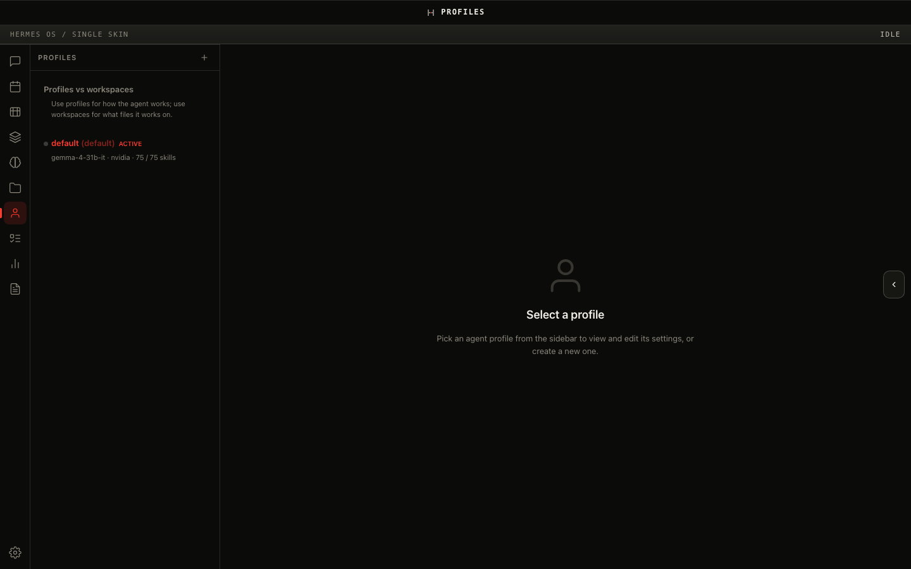<br />
      <sub><b>Profiles</b> — agent profiles, red index on the active row</sub>
    </td>
    <td align="center">
      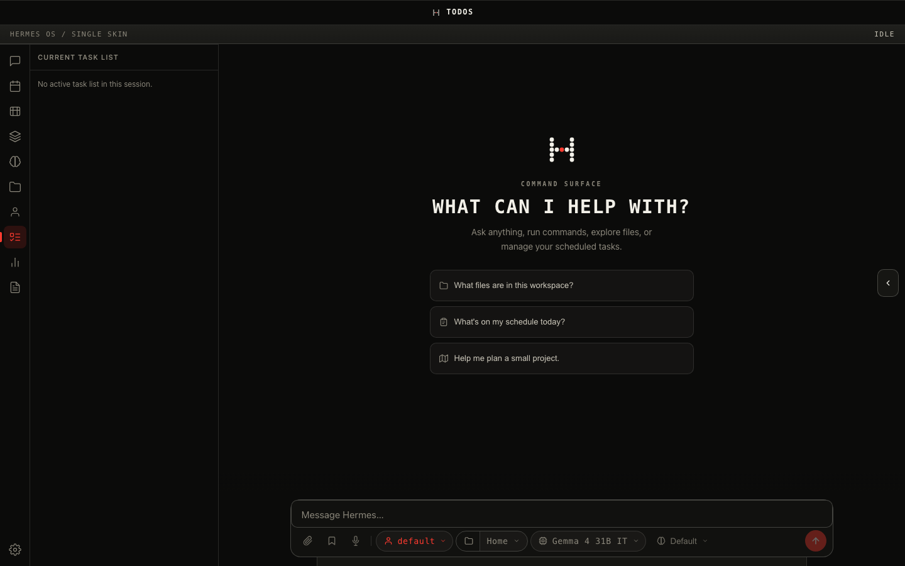<br />
      <sub><b>Todos</b> — current task list with status glyphs</sub>
    </td>
  </tr>
  <tr>
    <td align="center">
      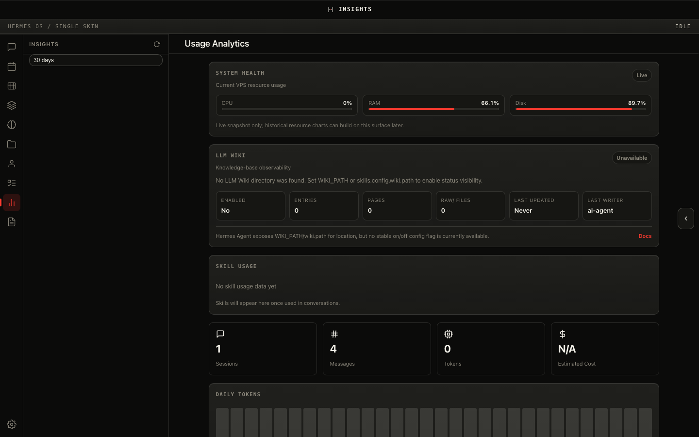<br />
      <sub><b>Insights</b> — usage analytics on OS surfaces</sub>
    </td>
    <td align="center">
      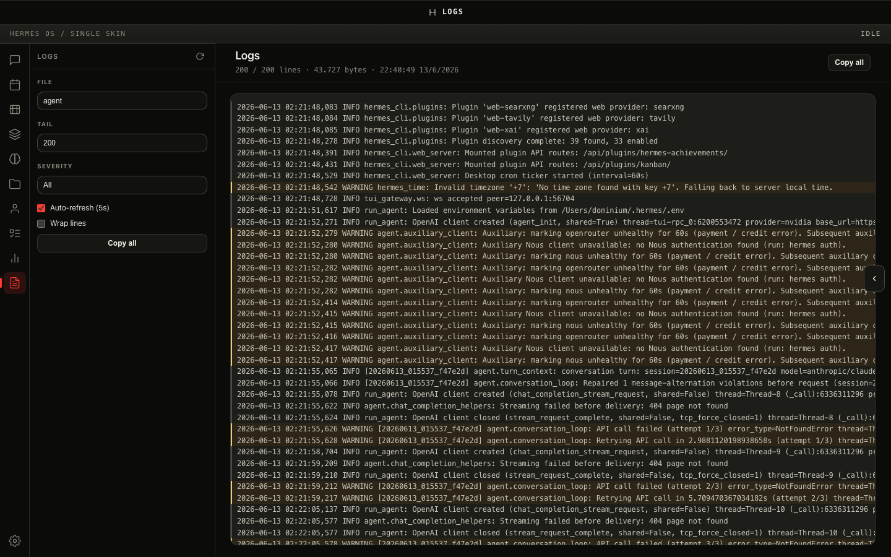<br />
      <sub><b>Logs</b> — mono rows, severity as a left LED bar</sub>
    </td>
  </tr>
  <tr>
    <td align="center">
      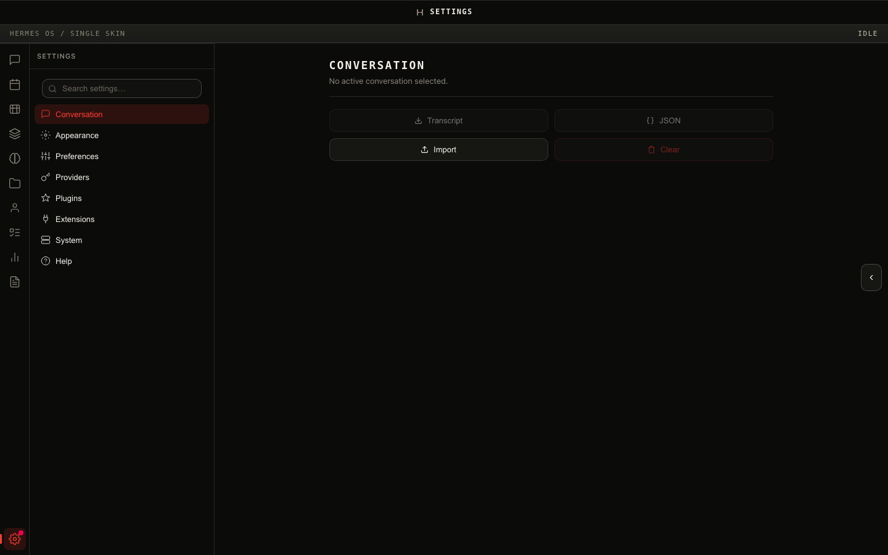<br />
      <sub><b>Settings</b> — grouped rows, thin red selection</sub>
    </td>
    <td align="center">
      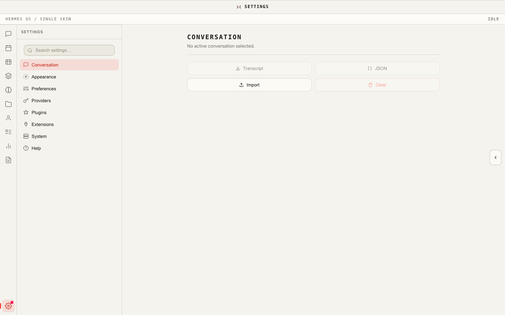<br />
      <sub><b>Settings (light)</b> — same layout, inverted surfaces</sub>
    </td>
  </tr>
</table>

---

## Requirements

- **Python 3.11 or newer.** The server uses 3.10+ syntax. `bootstrap.py`
  auto-selects `python3.13` / `python3.12` / `python3.11` and **refuses** to build
  the environment from an older interpreter (with a clear message). On macOS the
  default `python3` is often 3.9 — install a newer one:
  - macOS: `brew install python@3.11`
  - Ubuntu/Debian: `sudo apt install python3.11 python3.11-venv`
- **Hermes Agent** installed at `~/.hermes/hermes-agent` (the bootstrap can install
  it for you). This UI imports the agent as a library — it does not modify it.
- **Install via `git clone`** (not a ZIP download) so `git describe` produces a
  real version stamp. That version pins the service-worker cache name, so the
  browser cache busts on every deploy — preventing stale-cache blank pages.

---

## Install & run (step by step)

```bash
# 1. Clone THIS repo
git clone https://github.com/baquancoo-xorg/hermes-webui-nothingOS.git hermes-webui
cd hermes-webui

# 2. Create the env file and set a login password
cp .env.example .env
#    edit .env → set HERMES_WEBUI_PASSWORD=your-strong-password

# 3. Start (bootstrap builds a .venv with Python 3.11+, finds the agent, serves)
python3 bootstrap.py
```

Then open **http://127.0.0.1:8787** and log in with the password from `.env`.
The first run drops you into an onboarding wizard to finish provider setup.

> **Tip — first open after an upgrade:** do a hard reload (Cmd/Ctrl + Shift + R)
> once, so the browser picks up the new service-worker cache.

### Run as a background daemon

```bash
./ctl.sh start      # background daemon; logs at ~/.hermes/webui.log
./ctl.sh status     # PID, uptime, host/port, /health
./ctl.sh restart
./ctl.sh stop
```

### Stop, depending on how you started it

| Launched with | Stop with |
|---|---|
| `python3 bootstrap.py` | **Ctrl-C** in the terminal |
| `./ctl.sh start` | `./ctl.sh stop` |
| `./start.sh` / detached | `lsof -i :8787` → `kill <pid>` |

---

## Using the theme toggle

1. Open the **Hermes Control Center** (gear icon, bottom-left).
2. Go to **Appearance**.
3. Pick **Dark** or **Light** — applies instantly and is remembered across reloads.

You can also type `/theme light` or `/theme dark` in the composer.
The skin is locked to NothingOS; old skin/theme values in your browser cannot
change it back.

---

## Remote access

The server binds to `127.0.0.1` by default. To reach it from another machine:

- **SSH tunnel:** `ssh -N -L 8787:127.0.0.1:8787 user@your-server`, then open
  `http://localhost:8787`.
- **Tailscale / LAN:** set `HERMES_WEBUI_HOST=0.0.0.0` **and**
  `HERMES_WEBUI_PASSWORD`, then browse to `http://<server-ip>:8787`.

Full walkthrough: [`docs/remote-access.md`](docs/remote-access.md).

---

## Deploy, switch & rollback

To replace a WebUI you're already running with this edition — including how to
switch production, recover from a blank page, and roll back to the previous
build — see **[`docs/nothingos-deploy.md`](docs/nothingos-deploy.md)**.

The pre-NothingOS state is preserved on the **`archive/tungbillee-nothingos`**
branch, so rollback is a single `git checkout`.

---

## Configuration

`bootstrap.py` / `start.sh` auto-discover the agent dir, Python, state dir,
workspace, and port. Common overrides:

| Variable | Default | Description |
|---|---|---|
| `HERMES_WEBUI_PASSWORD` | *(unset)* | Set to enable login auth |
| `HERMES_WEBUI_PORT` | `8787` | Port |
| `HERMES_WEBUI_HOST` | `127.0.0.1` | Bind address (`0.0.0.0` to expose) |
| `HERMES_WEBUI_STATE_DIR` | `~/.hermes/webui` | Sessions & settings (kept across upgrades) |
| `HERMES_WEBUI_DEFAULT_WORKSPACE` | `~/workspace` | Default workspace |
| `HERMES_HOME` | `~/.hermes` | Base dir for Hermes state |

State lives **outside** the repo at `~/.hermes/webui/`, so upgrades and rollbacks
never touch your sessions. Full env list + Docker setup: see the docs below.

---

## Troubleshooting

- **Blank page after install/upgrade** → hard reload once (Cmd/Ctrl+Shift+R). If
  it persists: DevTools → Application → Service Workers → **Unregister** + Clear
  storage → reload. Verify the server replaced placeholders:
  `curl -s http://HOST:8787/ | grep -c __WEBUI_VERSION__` should print `0`.
- **`bootstrap` errors about Python version** → install Python ≥ 3.11 (see
  Requirements) and re-run `python3 bootstrap.py`.
- **"AIAgent not available" / chat fails** → the Hermes Agent engine isn't found
  at `~/.hermes/hermes-agent`. See [`docs/troubleshooting.md`](docs/troubleshooting.md).

---

## Tests

```bash
./scripts/test.sh                       # full suite (creates a 3.11+ .venv)
./scripts/test.sh tests/test_x.py -v    # focused run
```

CI runs ~10.5k tests across 3 shards on Python 3.11–3.13.

---

## Docs

- [`docs/nothingos-deploy.md`](docs/nothingos-deploy.md) — deploy / switch / rollback (this edition)
- [`docs/onboarding.md`](docs/onboarding.md) — first-run wizard & provider setup
- [`docs/remote-access.md`](docs/remote-access.md) — SSH tunnel, Tailscale, phone
- [`docs/docker.md`](docs/docker.md) — Docker compose setups
- [`docs/troubleshooting.md`](docs/troubleshooting.md) — common failures
- [`ARCHITECTURE.md`](ARCHITECTURE.md) — backend/frontend layout & API catalog

---

## Credits

- Upstream backend & shell: **[nesquena/hermes-webui](https://github.com/nesquena/hermes-webui)** (MIT)
- Agent engine: **[NousResearch/hermes-agent](https://github.com/NousResearch/hermes-agent)** (MIT)
- Extra feature modules adapted from the Tungbillee fork.
- NothingOS-inspired design — original work; not affiliated with Nothing Technology,
  no Nothing logos/fonts/assets used.

Licensed under MIT.
